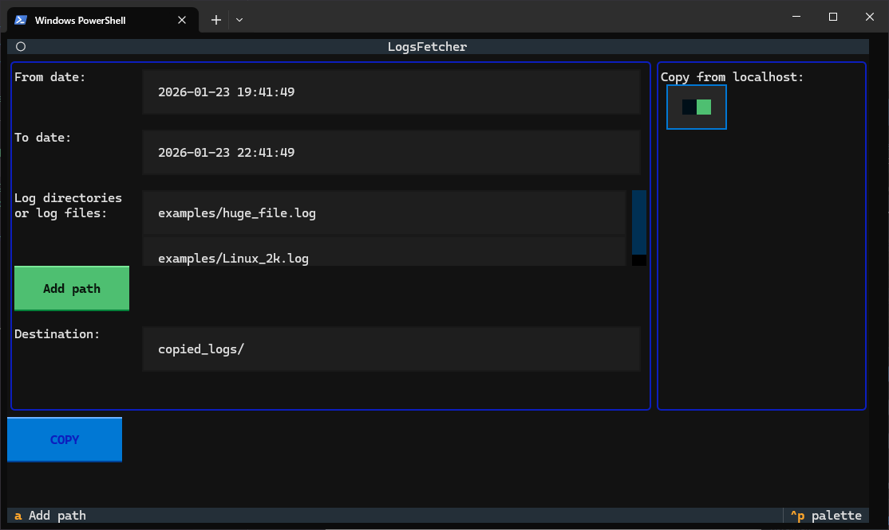
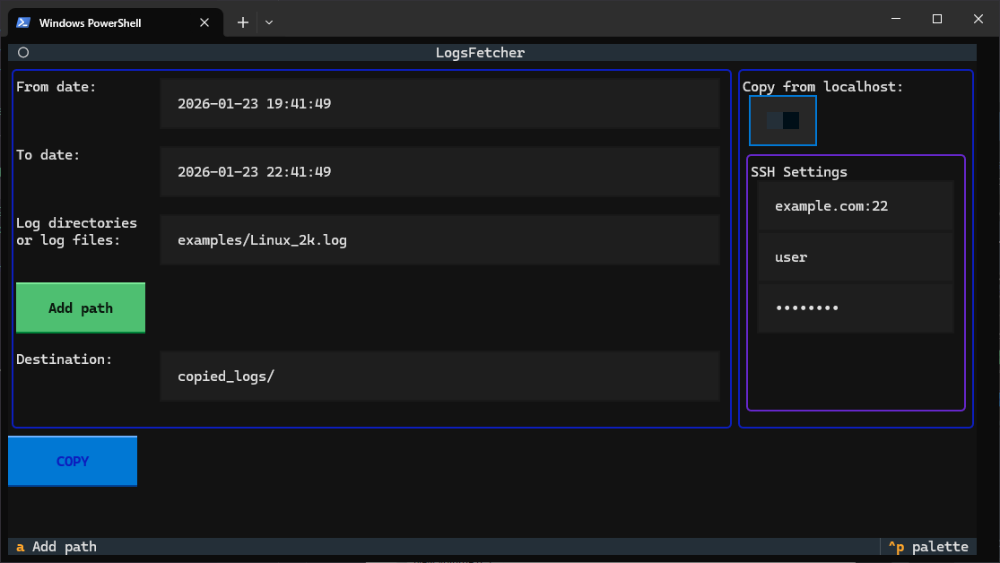

# LogHarvester is an interactive terminal tool for extracting log files by date range from local system or remote servers via SSH.


LogHarvester is a lightweight, interactive terminal application for extracting and filtering log files by date range. Whether you're troubleshooting issues across multiple servers or analyzing logs from your local system, LogHarvester makes it easy to collect relevant log segments without manual searching.

## Key Features:

* Date-range filtering - Quickly extract logs within specific timeframes
* Multi-source support - Fetch logs from local directories or remote servers via SSH
* Batch processing - Handle multiple log files and directories in one operation
* Interactive UI - User-friendly terminal interface built with [Textual](https://github.com/textualize/textual/)
* SSH integration - Securely connect to remote systems with configurable credentials

## Examples of usage
### Local machine log harvesting
The interface is very simple and intuitive.<br>
First, you specify the time range you want to cut logs of.<br>
Then, Choose the source directory(s) and the destination folder.<br>
And press the "COPY" button!


<details>
  <summary>Multiple log file sources</summary>
  To add another source with logs (directory or file), just press the "Add path" button (or hotkey "a").

  

</details>


### Remote server log harvesting

To harvest logs from a remove server, you have to:
1. Switch off the "Copy from localhost" toggle;
2. Specify IP(domain name), port (optional), SSH username and SSH password.
Then, [fill out the rest of the fields as for the local machine log harvesting ](./README.MD#local-machine-log-harvesting)

<details>
  <summary>Example</summary>

  

</details>

## Advanced usage settings

If you are a real log-gigachad 💪🦄💪, you may want to save the settings for reuse.<br>
LogHarvester has this feature.<br>
To do that, you may fill out the default settings in `src\log_harvester\settings.json`.<br>
So, they'll be loaded each time you start the LogHarvester!<br>

<details>
  <summary>Static settings</summary>

```
{
    "slow_mode": false,
    "copy_from_local": true,
    "debug_level": "WARNING",          
    "log_harvester_log_file_path": "harverster_logs/app.log",
    "log_file_path": "examples/Linux_2k.log",
    "dest_path": "copied_logs/",
    "ssh_settings" :{
        "hostname": "example.com",
        "port": 22,
        "username": "user",
        "password": "password"
    }
}
```

* `slow_mode` - will be implemented in the future 🦍
* `copy_from_local` - "Copy from localhost" toggle default value;
* `debug_level` - Logging levels: DEBUG, INFO, WARNING, ERROR, CRITICAL. **NOTE: DEBUG and more detailed log levels can make LogHarvester slow.**;
* `log_harvester_log_file_path` - Path to the app log;
* `log_file_path` - directory or file with logs;
* `dest_path` - directory with cut log files;
* `hostname` - ip or domain name of the remote machine with logs;
* `port` - SSH port of the remote machine with logs;
* `username` - SSH username;
* `password` - user's password;

</details>

## How to run code

The project is extremely simple.
Just recreate the environment after cloning and run `main.py`
```
python -m venv venv
source venv/bin/activate  # or venv\Scripts\activate on Windows
python3 -m pip install -r requirements.txt
python3 ./main.py
```
<details>
  <summary>Build executable file</summary>

Windows:
```
pyinstaller \
  --onefile \
  --name log_harvester \
  --add-data "src/log_harvester/default_settings.json;." \
  --add-data "src/log_harvester/log_harvester.tcss;." \
  src/log_harvester/main.py
```

Linux:
```
pyinstaller \
  --onefile \
  --name log_harvester \
  --add-data "src/log_harvester/default_settings.json:." \
  --add-data "src/log_harvester/log_harvester.tcss:." \
  src/log_harvester/main.py
```
</details>

## Known issues (WIP)
* *In case something goes wrong, it doesn't let you know, but only prints errors in the app.log.*
* *The "slow mode" is not implemented yet. It should reduce the resource consumption when user works with huge logs*

## Further improvements (Wishlist)
* Add regexp support for the source of the logs ("Log directory or log files" field);
* Add slow mode, for cases when huge number of logs may affect system performance;
* Support of SSH ceritificates.
